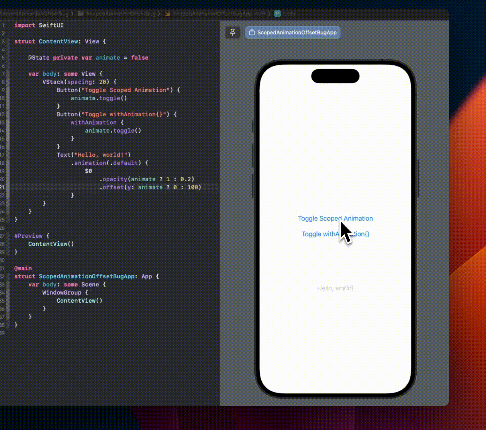

# SwiftUI Scoped Offset Animation Not Working

This repository demonstrates a SwiftUI bug when the [`.offset()`](https://developer.apple.com/documentation/swiftui/view/offset(x:y:)) modifier doesn't work when used inside a scoped animation ([`.animation(_:body:)`](https://developer.apple.com/documentation/swiftui/view/animation(_:body:))).

The target view has `.opacity()` and `.offset()` modifiers in a [scoped animation](https://developer.apple.com/documentation/swiftui/view/animation(_:body:)) (iOS 17):

```swift
Text("Hello, world!")
    .animation(.default) {
        $0
            .opacity(animate ? 1 : 0.2)
            .offset(y: animate ? 0 : 100) // <-- DOESN'T WORK
    }
```

 But only the `.opacity()` works when the state is changed directly or `withAnimation{}`. The `.offset()` only works when using `withAnimation{}`, even though it should animate in both cases, like opacity.



The code to replicate this:

```swift
import SwiftUI

struct ContentView: View {
    
    @State private var animate = false
    
    var body: some View {
        VStack(spacing: 20) {
            Button("Toggle Scoped Animation") {
                animate.toggle()
            }
            Button("Toggle withAnimation{}") {
                withAnimation {
                    animate.toggle()
                }
            }
            Text("Hello, world!")
                .animation(.default) {
                    $0
                        .opacity(animate ? 1 : 0.2)
                        .offset(y: animate ? 0 : 100) // <-- DOESN'T WORK
                }
        }
    }
}

#Preview {
    ContentView()
}

@main
struct ScopedAnimationOffsetBugApp: App {
    var body: some Scene {
        WindowGroup {
            ContentView()
        }
    }
}
```

Tested on Xcode 15.3 (15E204a), iOS 17.4 Simulator and iPhone Device.
